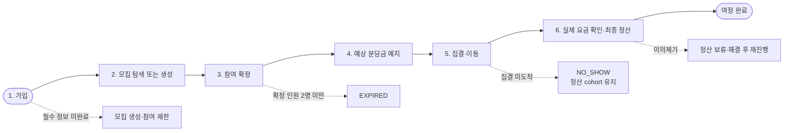
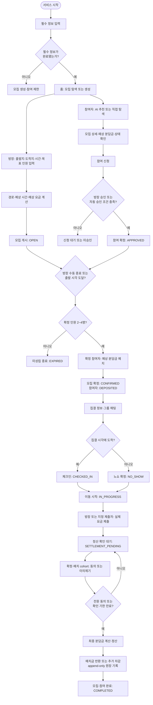
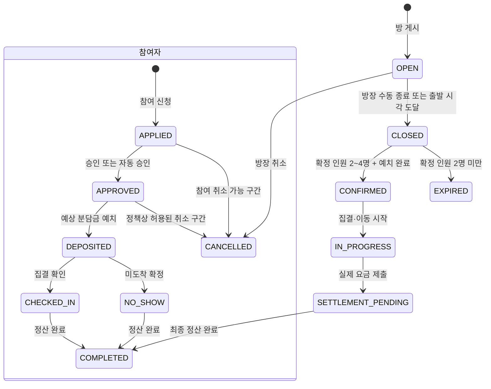
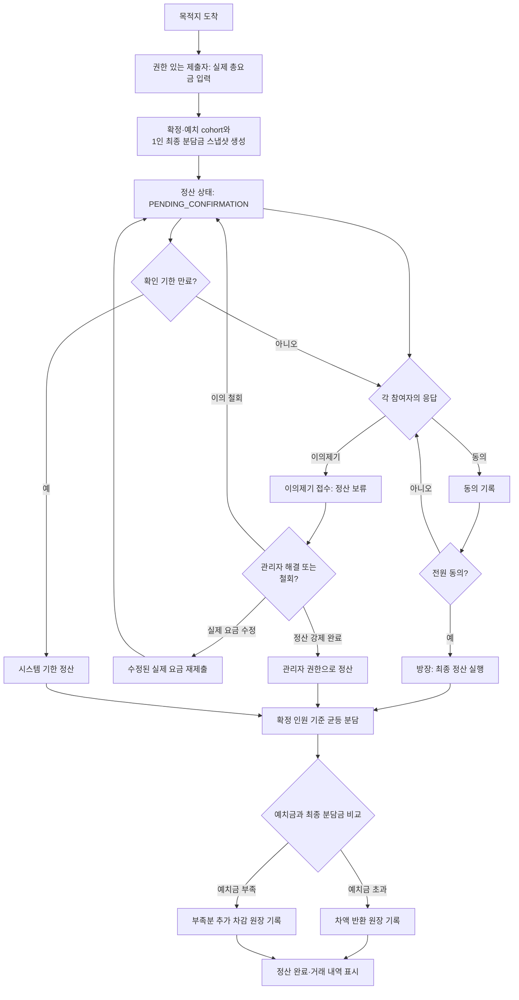
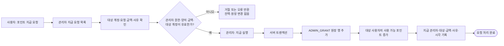
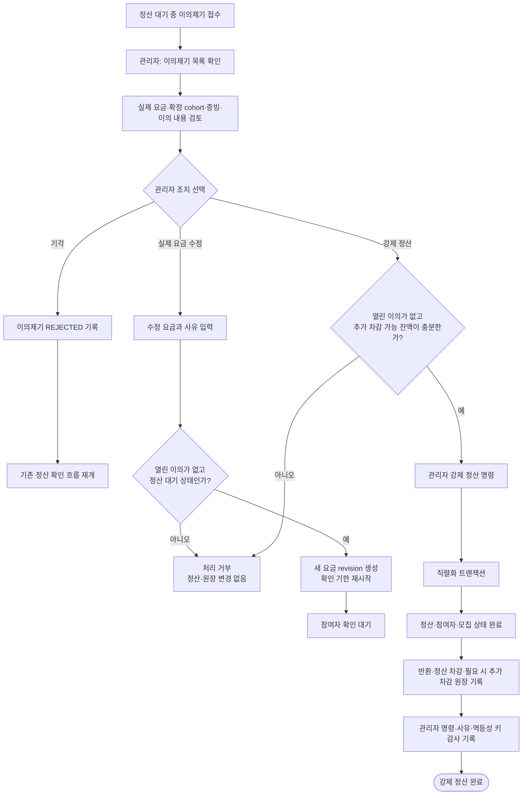

# TaxiTaShare 사용자 여정

관련 요구사항: `FR-01`~`FR-04`, `FR-10`~`FR-15`, `FR-17`~`FR-19`,
`FR-20`~`FR-25`, `FR-30`~`FR-40`, `FR-50`~`FR-54`, `TR-01`~`TR-03`.

이 문서는 `docs/prd.md`의 MVP 사용자 시나리오와 상태 정의를 한눈에
검토하기 위한 흐름도다. 실제 카드 결제·사용자 직접 충전·현금 인출은
MVP 범위에 포함하지 않는다.

## 한눈에 보는 6단계

실선은 사용자가 정상적으로 진행하는 길이고, 점선은 여정에서 이탈하거나
별도 처리가 필요한 예외다. 자세한 권한·상태 전이는 다음 섹션에서 확인한다.

| 단계 | 사용자가 확인하는 핵심 정보 | 통과 조건 |
|---|---|---|
| 1. 가입 | 필수 프로필 | 필수 정보 완성 |
| 2. 탐색/생성 | 출발·도착·시간·예상 분담금 | 열린 모집 또는 새 모집 |
| 3. 참여 확정 | 승인 결과·확정 인원 | 2~4명 확정 |
| 4. 예치 | 1인 예상 분담금·예치 잔액 | 확정 참여자 전원 예치 |
| 5. 집결·이동 | 집결 정보·체크인 상태 | 체크인 또는 노쇼 확정 |
| 6. 정산 | 실제 요금·1인 최종 분담금·거래 내역 | 전원 동의 또는 기한 만료 |

## 정상 사용자 여정

## 모집 및 참여 상태

`OPEN` 상태에서만 신규 신청과 승인이 가능하다. 출발 전 모집이 닫힌 뒤에는
신규 참여를 허용하지 않으며, 출발 가능한 모집은 확정 인원이 최소 2명일 때만
성립한다.

## 정산과 이의제기 흐름

정산 대상은 실제 탑승 인원이 아니라 **확정·예치 cohort**다. 따라서 노쇼도
정산 대상에서 제외되지 않는다. 예치·반환·추가 차감·정산 완료는 서버 권한
검증, 데이터베이스 트랜잭션, 멱등성 키 및 원장 기록으로 처리한다.

## 관리자 운영 흐름

관리자는 `ADMIN` 역할의 활성 계정만 수행할 수 있다. 관리자는 사용자를 대신해
포인트를 충전하거나 현금을 지급하지 않으며, MVP에서는 가상 포인트 지급과
정산·이의제기 처리만 수행한다.

### 포인트 지급 요청 처리

### 정산 이의제기 처리

| 관리자 조치 | 선행 조건 | 변경 결과 | 감사·재시도 경계 |
|---|---|---|---|
| 포인트 지급 | 활성 `ADMIN`, 유효 대상, 양의 금액·사유 | 사용 가능 포인트 증가 | `ADMIN_GRANT` 원장 및 지급 이력 |
| 이의 기각 | 정산 대기 중 열린 이의 | 기존 실제 요금 제안 유지 | 이의 해결 이력 |
| 실제 요금 수정 | 정산 대기, 다른 열린 이의 없음 | 새 요금 revision·새 확인 기한 | 관리자 명령과 수정 사유 |
| 강제 정산 | 정산 대기, 다른 열린 이의 없음, 부족분 차감 가능 | 정산·참여자·모집 완료 | 단일 트랜잭션, 원장, 멱등성 키 |

관리자 조치로도 확정·예치 cohort를 임의로 바꾸거나, 완료된 정산을 수정하거나,
기존 원장 행을 수정·삭제할 수 없다. 실패·권한 부족·중복 요청은 완료로 표시하지
않고 상태와 원장을 보존한다.

## 정책상 미결 항목

- 모집 종료 후 또는 예치 후 취소의 수수료·환불 기준
- 노쇼 예치금 중 최종 분담금을 초과한 금액의 전액 반환 또는 제재 차감 여부
- 실제 택시 기사 요금의 지급·안내 방식
- 분쟁 판단에 사용할 증빙과 운영 기준

위 항목은 PRD에서 열린 결정으로 남아 있으므로, 다이어그램은 현재 확정된
상태·권한 경계만 표현한다.
